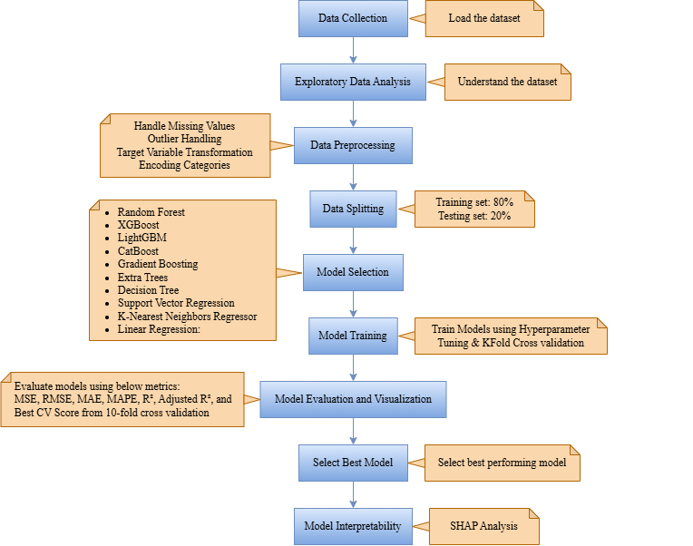

# Medical Insurance Price Prediction


## 📖 Introduction

This project is a web application that predicts medical insurance costs for individuals based on their personal attributes. It features an interactive, user-friendly interface where users can input their information—such as age, sex, BMI, and smoking habits—to receive an instant price estimate. The project combines a robust machine learning model with a responsive web front-end to provide a seamless user experience.

---

## 🌐 Live Demo
🚀 
**[Launch!](https://medical-insurance-cost-prediction-u6rt.onrender.com/)** 

## 🎯 Project Goals

*   **Predictive Accuracy:** To build and deploy a reliable machine learning model that accurately predicts medical insurance charges.
*   **User Experience:** To create an intuitive and responsive web interface that makes it easy for users to get predictions.
*   **Educational Tool:** To serve as a demonstration of a full-stack machine learning application, from data analysis and model training to deployment.
*   **Transparency:** To provide users with information about the dataset and the factors that influence insurance costs.

## 💻 Technologies Used

This project is built with a combination of data science and web development technologies:

| Category          | Technology / Library | Version    |
| ----------------- | -------------------- | ---------- |
| **Backend**       | Flask                | (latest)   |
| **ML & Data**     | NumPy                | `1.23.5`   |
|                   | Pandas               | `1.5.3`    |
|                   | Scikit-learn         | `1.2.2`    |
|                   | SciPy                | `1.10.1`   |
| **ML Models**     | XGBoost              | `1.7.3`    |
|                   | LightGBM             | `3.3.5`    |
|                   | CatBoost             | `1.1.1`    |
| **Visualization** | Matplotlib           | `3.7.1`    |
|                   | Seaborn              | `0.12.2`   |
|                   | Plotly               | `5.13.1`   |
| **Explainability**| SHAP                 | `0.41.0`   |
| **Frontend**      | HTML, CSS, JavaScript|            |


## 📊 Dataset

The model is trained on the **"Medical Cost Personal Datasets"** from Kaggle. This dataset contains 1,338 observations with the following attributes:

*   **`age`**: Age of the primary beneficiary.
*   **`sex`**: Gender of the beneficiary (female, male).
*   **`bmi`**: Body Mass Index, a measure of body fat.
*   **`children`**: Number of children/dependents covered by the insurance.
*   **`smoker`**: Whether the person is a smoker (yes, no).
*   **`region`**: The beneficiary's residential area in the US (northeast, southeast, southwest, northwest).
*   **`charges`** (Target): Individual medical costs billed by health insurance.

The complete data analysis and visualization can be found in the `Visualisations (EDA).ipynb` notebook.

## 🤖 Model

The prediction model is an XGBoost Regressor. 
- The target variable (`charges`) was log-transformed (`log(x+1)`) to handle its skewness, a common practice for price prediction. 
- The categorical features (`sex`, `smoker`, `region`) were converted into a numerical format for the model.

## ⚙️ How It Works

### Model Training Workflow

The entire process of building the predictive model is detailed in the project's Jupyter Notebooks and follows these steps:



## ✨ Why It Matters

Understanding potential healthcare costs is crucial for financial planning. This tool provides a quick and accessible way for individuals to get a data-driven estimate of their medical insurance expenses. For developers and data scientists, this project serves as a practical, end-to-end example of how to build and deploy a machine learning model as a web service.

## 📄 Published Paper

**Predicting Medical Insurance Costs: A Machine Learning Approach for Smarter Risk Assessment**  
_Published at 2025 International Conference on Computational Robotics, Testing and Engineering Evaluation (ICCRTEE)_  
[DOI: 10.1109/ICCRTEE64519.2025.11052963](https://doi.org/10.1109/ICCRTEE64519.2025.11052963)

## 🛠️ How to Run This Project Locally

1.  **Clone the repository:**
    ```bash
    git clone https://github.com/lalith-kumar-raju/Medical-Insurance-Price-Prediction.git
    cd Medical-Insurance-Price-Prediction
    ```

2.  **Create and activate a virtual environment:**
    ```bash
    python -m venv venv
    # On Windows
    venv\Scripts\activate
    # On macOS/Linux
    source venv/bin/activate
    ```

3.  **Install the dependencies:**
    ```bash
    pip install -r requirements.txt
    ```

4.  **Run the Flask application:**
    ```bash
    python app.py
    ```

5.  Open your web browser and go to `http://127.0.0.1:5000/` to use the application.

## ✍️ Authors

Made with ❤️ by:

- **Lalith kumar raju Somalaraju**  
  [](https://github.com/lalith-kumar-raju) [](https://www.linkedin.com/in/lalith-kumar-raju-somalaraju/) [](mailto:ssivaprasadraju1978@gmail.com)
- **Edapalapati Venkata Bala Jyothi Swaroop**  
  [](https://github.com/EDAPALAPATIVENKATABALAJYOTHISWAROOP) [](https://www.linkedin.com/in/edapalapati-venkata-bala-jyothi-swaroop/) [](mailto:edapalapatiswaroop@gmail.com)
- **Venkata Sai Mahesh Bodagala**  
  [](https://github.com/Mahesh15206) [](https://www.linkedin.com/in/venkata-sai-mahesh-bodagala/) [](mailto:bvsmahesh2006@gmail.com)


--- 